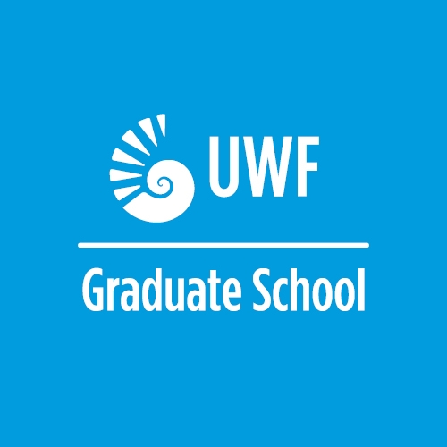

 
 {: style="width: 100px; float: left;margin-right: 20px; border: 10px"}  
 
 
## Computational Statistics and Data Analytics Lab at UWF

**CSDA** (Computational Statistics and Data Analytics) is a **student-centered research group** in the Department of Mathematics and Statistics, the Hal Marcus College of Science and Engineering at the University of West Florida, working on research projects in data science, statistical process monitoring, computational neuroscience, probability distributions, applied machine learning and AI. The following are the main areas of research (but not limited to):

- **Statistical / Predictive modeling**: Applying statistics and machine learning to solve multidisciplinary problems in Engineering, Biology, Chemistry, Education, Sports, and Health, to name a few.
- **Statistical process monitoring**: Developing and evaluating statistical methods for system monitoring purposes, including fault detection and diagnostics, health monitoring, profile monitoring, IoT monitoring, image monitoring, etc.
- **Probability distributions**: Investigating and developing new probability distributions for various applications.
- **Neuroscience**: Leveraging machine learning / statistical modeling to understand the brain neuron connections.
- **Tooling**: Developing R packages and Shiny apps.

## Methods and Technologies

The CSDA Lab is primarily a data analytics group that uses a wide range of statistical and mathematical methods, including:
- Exploratory Statistical Analysis: Principal component analysis (PCA), multiple correspondence analysis (MCA), and more.
- Statistical Modeling: Poisson regression, Negative Binomial regression, Zero-Inflated models, Gamma regression, Mixed models, Time Series, hypothesis testing, Cox models, and more.
- Clustering techniques: k-means, latent class analysis (LCA), and more.
- Classification: SVM, regressions, Random forest, and more.
- Predictive models: RNN, CNN, regression, LSTM, and more.
- Imputation methods: MICE, EM, and more.
- Signal processing: Wavelet analysis, Fourier transforms, multiscale analysis, and more. 
- Tools: R, Quarto, Python, SAS, and MATLAB.

### Collaborators
- Thatayaone Moakofi, Ph.D. Statistics Student in the Department of Mathematics and Statistical Sciences, Botswana International University of Science and Technology. Email: thatayaone.moakofi@studentmail.biust.ac.bw 
- Prof. Broderick Oluyede

### Joining CSDA Lab
If you are interested in joining, please go to the [recruitment](recruitment) page.

### Funding

